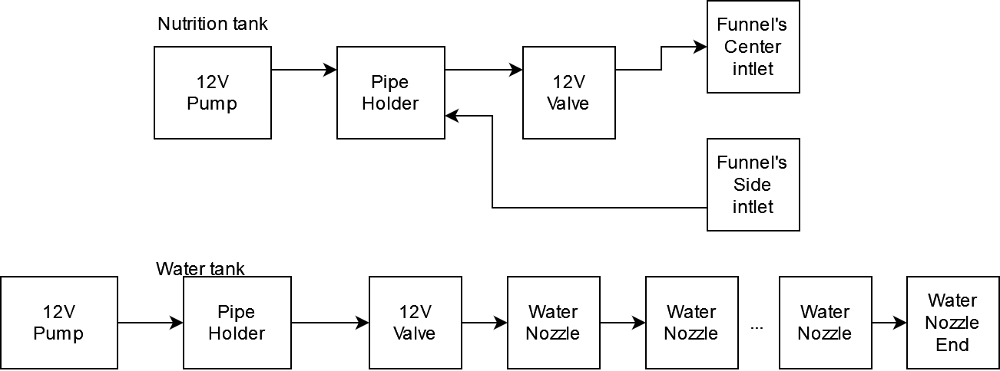

# Thingy:53 Aeroponic Garden
2nd place in [Smarter Sustainable World Challenge
with Nordic Semiconductor](https://www.hackster.io/contests/smarter-sustainable-world). For details of the project itself see [Vertical Self Regulating Soilless Farm](https://www.hackster.io/Tai-Min/vertical-self-regulating-soilless-farm-a86d25)

## Physical setup
### The pot
* Print heater_bottom_n.stl and heater_top_n.stl (n = 1, 2, 3, 4) and glue them together. Insert 12V 5050 fan into place
* Print funnel.stl and insert it into heater glued in previous step
* Print num_layers * 4 layer_quarter.stl and glue them together then stack the layers and place them on top of the heater
* Print num_layers nozzle_frame.stl and num_layers * 4 nozzle_single.stl and glue them together then using straight plastic pipe assemble them starting from funnel's center intlet so that each nozzle_frame is on the level of the pot of given layer  
* Print nozzle_frame_end.stl and insert it at the top of previously created piping
* Print top_hat.stl and insert it at the top of vertical pot then insert Thingy:53 into it 
* Create wooden frame as in the pictures below
* Print valve_holder.stl and screw it at the bottom of the wooden quadropod then screw 12V valves into places
* Print num_layers * 4 - 1 of water_nozzle_frame.stl and nozzle_single.stl and glue them together then screw them on wooden structure so that each nozzle faces one pot
* Print 1 water_nozzle_frame_end.stl and single_nozzle.stl and glue them together and screw it on the wooden structure so it faces one pot
* Install LED strips on wooden structure so each pot has it's own light source


### RPi water system
* Print 2 pipe_holder_1.stl and pipe_holder_2.stl and glue them together on the side of both liquid tanks
* Print 2 pump_holder.stl and glue it at the bottom of the tank then screw the 12V pump into it
* Print 2 water_level_holder.stl, place it on the lids of both liquid tanks and then snap an ultrasonic sensor into them
* Screw reed switches into both liquid tanks and corresponding magnets into lids
* On nutrition water tank mount PCBs for EC and pH sensors and place the sensors into the tank itself


### Putting it together
Use flexible piping to connect the pot to water system as in the block diagram below:


## Electronics
Refer to KiCad project in /pi_shield folder for BOM and assembly purposes of the hats.

### The pot
Connect sensors / actuators to Thingy:53 control hat as in the block diagram below:


### RPi water system
Connect sensors / actuators to RPi's control hat as in the block diagram below:

## Attiny85
* Connect some programmer (i.e. ArduinoISP or USBasp) to Attiny85
* In platformio.ini change upload_protocol to your programmer
* You might also want to fine tune PH_MAGIC_NUMBER, TDS_A, TDS_B variables to match your sensor's characteristics
* In PlatformIO menu press "Set Fuses" in "attiny85" configuration, then click "Upload"
* Insert Attiny85 into Farm Overseers's shield

## Farm Overseer setup
* Setup Ubuntu Server 20.04 (i.e via [Raspberry Pi Imager](https://www.raspberrypi.com/software/))

### Enable UART
* Disable serial console
```
sudo systemctl stop serial-getty@ttyS0.service
sudo systemctl disable serial-getty@ttyS0.service
sudo systemctl mask serial-getty@ttyS0.service
```
* Put below into /etc/udev/rules.d/10-local.rules
```
KERNEL=="ttyS0", SYMLINK+="serial0" GROUP="tty" MODE="0660"
KERNEL=="ttyAMA0", SYMLINK+="serial1" GROUP="tty" MODE="0660"
```
* Reload udev rules
```
sudo udevadm control --reload-rules && sudo udevadm trigger
```
* Add user to tty (edit parts in "<>")
```
sudo adduser <USER> tty
```
* Delete below from /boot/firmware/cmdline.txt
```
console=serial0,115200
```
* Add below to /boot/firmware/config.txt
```
dtoverlay=disable-bt
```
### Enable 1-Wire
* Add below to /boot/firmware/config.txt
```
dtoverlay=w1-gpio,gpiopin=4
```

### ROS2
* Install [ROS2 Foxy Base version](https://docs.ros.org/en/foxy/Installation/Ubuntu-Install-Debians.html)
* Clone this repo to your home directory (/home/$USER/TODO)
* Build ROS components:
```bash
cd ~/TODO/ros_workspace && colcon build
```
* Place ROS setups in your .bashrc (edit parts in "<>")
```
source /opt/ros/foxy/setup.bash
source /home/<USER>/TODO/ros_workspace/install/setup.bash

```
### Mosquitto
* Install mosquitto 2.0
```
sudo add-apt-repository -y ppa:mosquitto-dev/mosquitto-ppa
sudo apt install mosquitto
sudo systemctl enable mosquitto
```

### zigbee2mqtt
* Install [zigbee2mqtt](https://www.zigbee2mqtt.io/guide/installation/01_linux.html) and set it to start as a daemon on boot. Use following config (edit parts in "<>"):
```yaml
mqtt:
  base_topic: field
  server: 'mqtt://localhost'

serial:
  port: <YOUR ZIGBEE DONGLE PORT>

advanced:
    network_key: GENERATE

external_converters:
  - fc.js
```

Create file /opt/zigbee2mqtt/data/fc.js and paste following into it:
```js
const fz = require('zigbee-herdsman-converters/converters/fromZigbee');
const tz = require('zigbee-herdsman-converters/converters/toZigbee');
const exposes = require('zigbee-herdsman-converters/lib/exposes');
const reporting = require('zigbee-herdsman-converters/lib/reporting');

const definition = {
    zigbeeModel: ['FC_v0.1'],
    model: 'FC',
    vendor: 'Nordic',
    description: 'Field Controller',
    fromZigbee: [fz.temperature, fz.humidity, fz.pressure, fz.on_off, fz.level_config],
    toZigbee: [tz.on_off, tz.level_config],
    exposes: [],
    configure: async (device, coordinatorEndpoint, logger) => {
        await reporting.bind(device.getEndpoint(16), coordinatorEndpoint, ['msTemperatureMeasurement']);
        await reporting.temperature(device.getEndpoint(16), { min: 30, max: 30, change: 0 });

        await reporting.bind(device.getEndpoint(16), coordinatorEndpoint, ['msPressureMeasurement']);
        await reporting.pressure(device.getEndpoint(16), { min: 30, max: 30, change: 0 });

        await reporting.bind(device.getEndpoint(16), coordinatorEndpoint, ['msRelativeHumidity']);
        await reporting.humidity(device.getEndpoint(16), { min: 30, max: 30, change: 0 });
    },
    endpoint: (device) => {
        return { fan: 10, led1: 11, led2: 12, strat: 13, water_valve: 14, nutri_valve: 15, sensors: 16 };
    },
};

module.exports = definition;
```

### Finishing up
* Reboot the board
```
sudo reboot now
```

## Field controller setup
Open field_controller/ in VSCode with nRF Connect and with Thingy:53 connected via JLink press flash.

## Run Farm Overseer's control algorithms
SSH into the Farm Overseer and run:
```
ros2 launch garden_meta system.launch.py
```

## Pair field controller to Farm Overseer
With Field Controller running cd into scripts/ and run:
```
./pair.sh -t 300
``` 
This will enable pairing for 300 seconds and should pair with the Field Controller.
